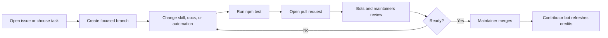

# Contributing to Manage Blowfish Hugo

[English](CONTRIBUTING.md) · [Tiếng Việt](CONTRIBUTING.vi.md)

Thank you for helping make Hugo and Blowfish work more reliably with AI coding
agents. Contributions of code, documentation, examples, tests, translations,
and issue triage are welcome.

## Before you start

- Search existing issues and pull requests.
- Use a discussion or feature request for broad design changes.
- Open a security advisory instead of a public issue for vulnerabilities.
- Keep each pull request focused on one coherent change.

## Development setup

Requirements:

- Git
- Node.js 20 or newer
- Python 3.11 or newer
- Hugo Extended when validating a real Blowfish site

```bash
git clone https://github.com/ginbarca/manage-blowfish-hugo.git
cd manage-blowfish-hugo
npm ci
npm test
```

## Where to make changes

| Change | Location |
| --- | --- |
| Core workflow or activation rules | `skills/manage-blowfish-hugo/SKILL.md` |
| Blowfish/Hugo knowledge snapshot | `skills/manage-blowfish-hugo/references/` |
| Deterministic project audit | `skills/manage-blowfish-hugo/scripts/` |
| Public documentation | `README*.md`, `docs/`, `CONTRIBUTING*.md` |
| Community automation | `.github/`, root `scripts/` |

Do not place repository-maintenance documentation inside the skill directory.
The skill should contain only instructions and resources an AI agent needs while
performing Hugo/Blowfish work.

## Updating a reference

1. Link the official source near the top of the reference.
2. Verify version-sensitive details against current Blowfish or Hugo
   documentation.
3. Summarize behavior; do not copy entire upstream pages.
4. Preserve progressive disclosure by editing only the relevant reference.
5. Update tests or examples when behavior changes.
6. Explain the upstream version or documentation revision in the PR.

## Translation policy

English is the canonical repository documentation. Vietnamese files use the
same filename plus `.vi` before the extension. A PR that changes user-facing
meaning in English should update Vietnamese in the same PR or open a linked
translation issue.

New languages are welcome. Use BCP 47 language tags, for example:

```text
README.ja.md
docs/INSTALLATION.ja.md
```

Do not translate `SKILL.md` into parallel copies unless there is a concrete
agent compatibility need; duplicated skill instructions drift quickly.

## Pull request workflow



Recommended branch and commit names:

```text
docs/kiro-installation
fix/audit-language-detection
feat/cloudflare-deployment-reference

docs: clarify Kiro global installation
fix: detect Blowfish module config in YAML
feat: document a new Blowfish shortcode
```

## Pull request checklist

- The change is scoped and documented.
- `npm test` passes.
- The skill still follows the Agent Skills structure.
- Official sources are linked for version-sensitive claims.
- English and Vietnamese public docs remain aligned.
- No credentials, personal data, generated build output, or theme vendor files
  are committed.
- Automation changes use least-privilege permissions and do not execute
  untrusted pull-request code.

## Review and merge

The issue and pull-request bots provide advisory reviews. Maintainers make all
merge decisions. Passing automation does not guarantee acceptance, and bot
comments never replace human security or licensing review.

By submitting a contribution, you agree that it may be distributed under this
repository's MIT License.

