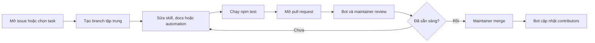

# Đóng góp cho Manage Blowfish Hugo

[English](CONTRIBUTING.md) · [Tiếng Việt](CONTRIBUTING.vi.md)

Cảm ơn bạn đã giúp Hugo và Blowfish hoạt động tin cậy hơn với AI coding agent.
Chúng tôi chào đón code, tài liệu, ví dụ, test, bản dịch và hỗ trợ phân loại
issue.

## Trước khi bắt đầu

- Tìm trong issue và pull request hiện có.
- Dùng discussion hoặc feature request cho thay đổi thiết kế lớn.
- Báo lỗ hổng bằng security advisory thay vì issue công khai.
- Mỗi pull request chỉ nên giải quyết một thay đổi thống nhất.

## Cài môi trường phát triển

Yêu cầu:

- Git
- Node.js 20 trở lên
- Python 3.11 trở lên
- Hugo Extended nếu xác minh trên project Blowfish thực tế

```bash
git clone https://github.com/ginbarca/manage-blowfish-hugo.git
cd manage-blowfish-hugo
npm ci
npm test
```

## Sửa file ở đâu?

| Loại thay đổi | Vị trí |
| --- | --- |
| Workflow lõi hoặc điều kiện kích hoạt | `skills/manage-blowfish-hugo/SKILL.md` |
| Bản tóm tắt kiến thức Blowfish/Hugo | `skills/manage-blowfish-hugo/references/` |
| Công cụ audit xác định | `skills/manage-blowfish-hugo/scripts/` |
| Tài liệu công khai | `README*.md`, `docs/`, `CONTRIBUTING*.md` |
| Automation cộng đồng | `.github/`, thư mục `scripts/` ở root |

Không đặt tài liệu bảo trì repository trong thư mục skill. Thư mục skill chỉ
chứa hướng dẫn và tài nguyên AI cần khi thực hiện công việc Hugo/Blowfish.

## Cập nhật reference

1. Đặt link nguồn chính thức gần đầu file.
2. Đối chiếu thông tin phụ thuộc phiên bản với tài liệu Blowfish hoặc Hugo mới.
3. Tóm tắt hành vi; không sao chép toàn bộ trang upstream.
4. Chỉ sửa reference liên quan để giữ cơ chế nạp context theo nhu cầu.
5. Cập nhật test hoặc ví dụ khi hành vi thay đổi.
6. Nêu rõ phiên bản hoặc revision upstream trong PR.

## Quy tắc bản dịch

Tiếng Anh là tài liệu chuẩn của repository. File tiếng Việt thêm `.vi` trước
phần mở rộng. PR làm thay đổi ý nghĩa tài liệu tiếng Anh cần cập nhật bản tiếng
Việt trong cùng PR hoặc mở issue bản dịch có liên kết.

Chúng tôi chào đón ngôn ngữ mới. Dùng mã BCP 47, ví dụ:

```text
README.ja.md
docs/INSTALLATION.ja.md
```

Không tạo nhiều bản dịch song song cho `SKILL.md` nếu chưa có nhu cầu tương
thích AI cụ thể, vì các bản instruction trùng lặp rất dễ lệch nhau.

## Quy trình pull request



Tên branch và commit đề xuất:

```text
docs/kiro-installation
fix/audit-language-detection
feat/cloudflare-deployment-reference

docs: clarify Kiro global installation
fix: detect Blowfish module config in YAML
feat: document a new Blowfish shortcode
```

## Checklist pull request

- Thay đổi có phạm vi rõ ràng và được mô tả.
- `npm test` chạy thành công.
- Skill vẫn đúng cấu trúc Agent Skills.
- Thông tin phụ thuộc phiên bản có link nguồn chính thức.
- Tài liệu công khai tiếng Anh và tiếng Việt vẫn đồng bộ.
- Không commit credential, dữ liệu cá nhân, build output hoặc source vendor của
  theme.
- Automation dùng quyền tối thiểu và không chạy code không tin cậy từ PR.

Bot review issue/PR chỉ đưa ra tư vấn. Maintainer quyết định việc merge. Việc
automation chạy thành công không đảm bảo PR sẽ được chấp nhận.

Khi gửi contribution, bạn đồng ý nội dung đó có thể được phân phối theo MIT
License của repository.

