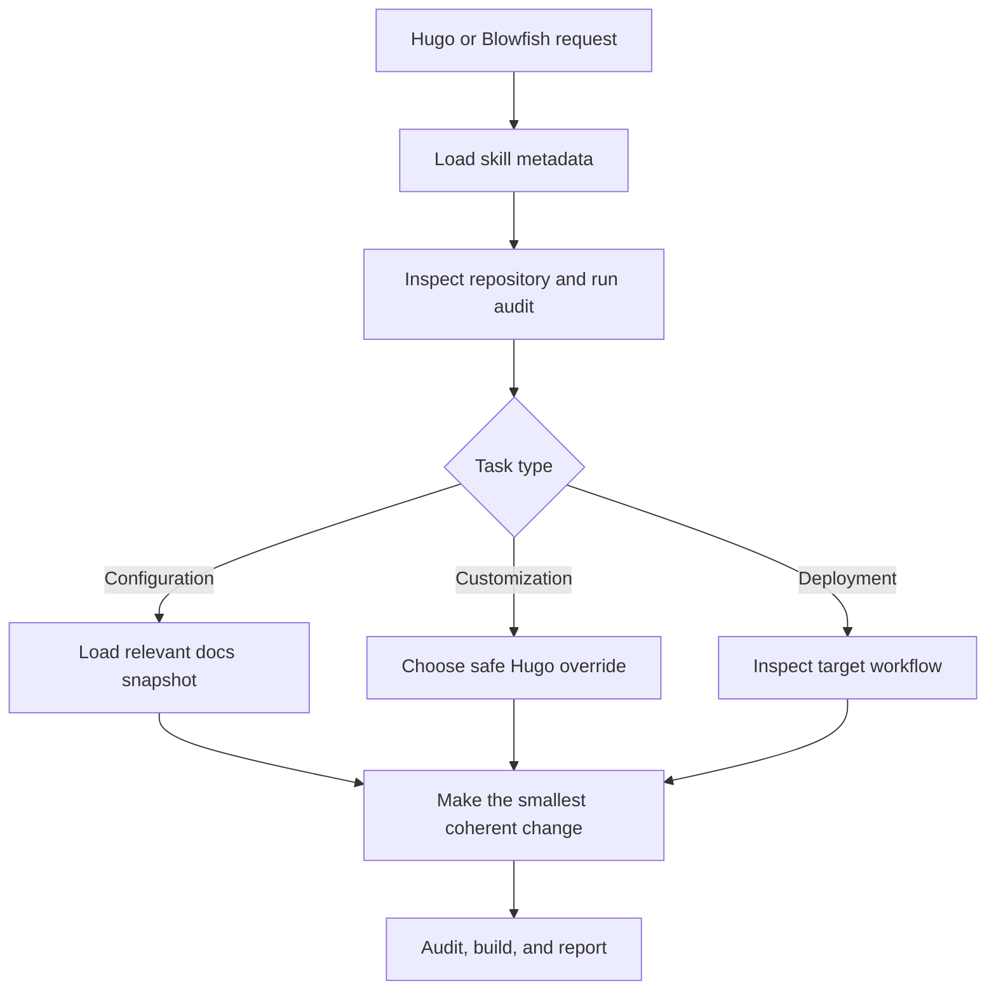

# Manage Blowfish Hugo

[](https://github.com/ginbarca/manage-blowfish-hugo/actions/workflows/ci.yml)
[](https://github.com/ginbarca/manage-blowfish-hugo/actions/workflows/upstream-sync.yml)
[](https://agentskills.io)
[](LICENSE)
[](https://github.com/sponsors/ginbarca)

**English** · [Tiếng Việt](README.vi.md)

An open-source Agent Skill that helps AI coding agents build, configure,
customize, audit, upgrade, and deploy Hugo websites powered by the
[Blowfish](https://blowfish.page/) theme.

The skill favors upgrade-safe Hugo conventions: inspect first, preserve the
installed dependency method, customize from the site root, and validate the
result before publishing.

## What it can do

- Create or repair Hugo + Blowfish sites.
- Configure languages, menus, authors, taxonomies, home layouts, articles, and
  search.
- Customize colors, CSS, icons, partials, shortcodes, thumbnails, and hero
  images without editing upstream theme files.
- Diagnose Hugo Module, Git submodule, manual-theme, Tailwind, and deployment
  issues.
- Preserve Blowfish front matter, page bundles, assets, and shortcode source
  when integrating a CMS or editor.
- Audit a repository with the bundled deterministic Python tool.
- Guide GitHub Pages, Netlify, Render, Cloudflare Pages, and self-hosted
  deployments.

## Supported AI agents

The core skill follows the open `SKILL.md` Agent Skills format.

| AI agent | Support | Recommended location |
| --- | --- | --- |
| OpenAI Codex / ChatGPT desktop | Native | `.agents/skills/` or `~/.agents/skills/` |
| Claude Code | Native | `.claude/skills/` or `~/.claude/skills/` |
| Kiro IDE / Kiro CLI | Native | `.kiro/skills/` or `~/.kiro/skills/` |
| Gemini CLI | Native | `.agents/skills/` |
| GitHub Copilot coding agent / CLI | Native | `.github/skills/`, `.agents/skills/`, or `~/.copilot/skills/` |
| Other Agent Skills-compatible tools | Compatible | Use the tool's documented skill directory |

See the [complete installation guide](docs/INSTALLATION.md) for project,
global, and manual installation instructions.

Maintainers publishing a new fork should follow the
[GitHub publishing checklist](docs/PUBLISHING.md).

## Quick start

Install with the community Skills CLI:

```bash
# Current project
npx skills add ginbarca/manage-blowfish-hugo

# All projects for the selected agent
npx skills add ginbarca/manage-blowfish-hugo --global
```

Then invoke it explicitly:

```text
Use manage-blowfish-hugo to audit this repository and propose the smallest
upgrade-safe fix.
```

Codex users can mention `$manage-blowfish-hugo`; Claude Code, Kiro, and Copilot
CLI users can invoke `/manage-blowfish-hugo`.

## How the skill works



Only `SKILL.md` is loaded when the skill activates. Detailed references and
scripts are loaded on demand, keeping agent context focused.

## Repository automation

This repository includes four maintainership bots:

| Bot | Trigger | Result |
| --- | --- | --- |
| Upstream Sync | Weekly or manual | Detects new Blowfish/Hugo releases and documentation revisions, then opens or refreshes an update PR |
| Issue Review | New or edited issue | Labels the issue and posts an AI-assisted completeness/triage review |
| Pull Request Review | New commits on a PR | Posts an AI-assisted review focused on Agent Skills quality, safety, docs parity, and tests |
| Contributors | Merged PR or manual run | Regenerates `CONTRIBUTORS.md` and opens a maintenance PR |

Bots create reviewable comments or pull requests; they do not merge code.
Configuration and permissions are documented in
[Automation](docs/AUTOMATION.md).

## Repository layout

```text
.
├── skills/manage-blowfish-hugo/
│   ├── SKILL.md
│   ├── agents/openai.yaml
│   ├── references/
│   └── scripts/audit_blowfish_project.py
├── scripts/
├── tests/fixtures/
├── docs/
└── .github/
```

The skill itself stays self-contained under `skills/manage-blowfish-hugo/`.
Repository documentation and community automation remain outside the skill so
they do not consume an agent's task context.

## Contributing

Issues, documentation improvements, new examples, compatibility fixes, and
translations are welcome. Start with
[CONTRIBUTING.md](CONTRIBUTING.md), read the
[Code of Conduct](CODE_OF_CONDUCT.md), and use the provided issue or pull
request templates.

```bash
npm ci
npm test
```

## Security

Do not report vulnerabilities in a public issue. Follow
[SECURITY.md](SECURITY.md) for private disclosure guidance.

## Sponsoring

If this skill saves you time, you can support maintenance through
[GitHub Sponsors](https://github.com/sponsors/ginbarca) or
[Buy Me a Coffee](https://buymeacoffee.com/nva1308u).

## License

Released under the [MIT License](LICENSE).
