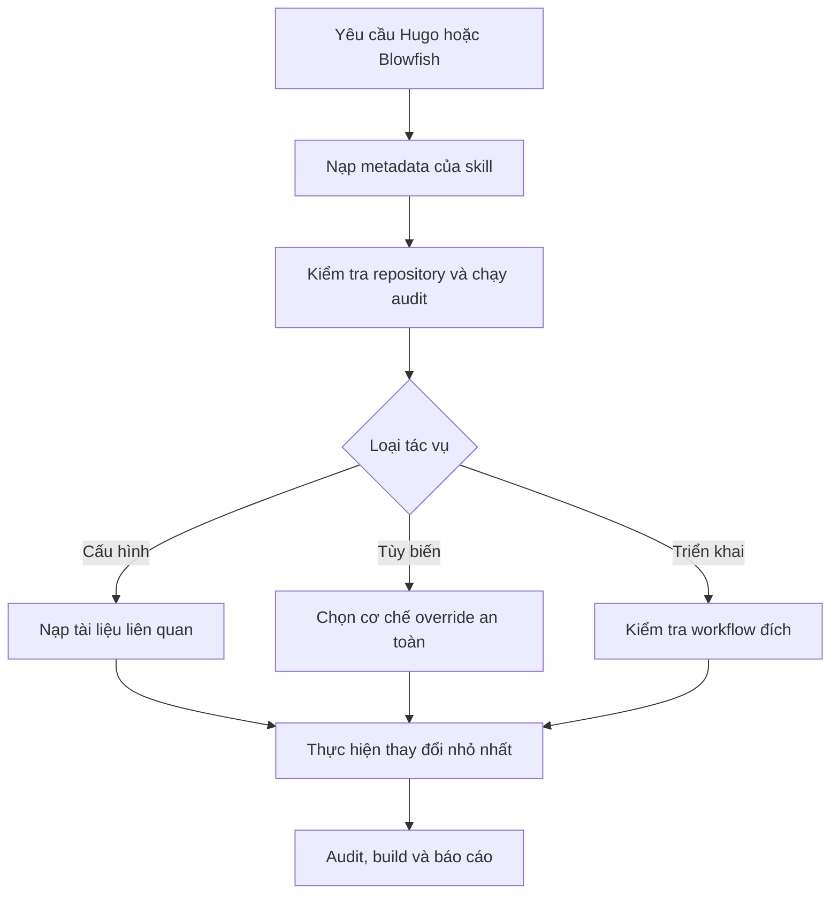

# Manage Blowfish Hugo

[](https://github.com/ginbarca/manage-blowfish-hugo/actions/workflows/ci.yml)
[](https://github.com/ginbarca/manage-blowfish-hugo/actions/workflows/upstream-sync.yml)
[](https://agentskills.io)
[](LICENSE)
[](https://github.com/sponsors/ginbarca)

[English](README.md) · **Tiếng Việt**

Một Agent Skill mã nguồn mở giúp các AI coding agent xây dựng, cấu hình, tùy
biến, kiểm tra, nâng cấp và triển khai website Hugo sử dụng theme
[Blowfish](https://blowfish.page/).

Skill ưu tiên các quy ước an toàn khi nâng cấp: kiểm tra project trước, giữ
nguyên phương thức cài dependency hiện tại, tùy biến từ thư mục gốc của site và
xác minh kết quả trước khi publish.

## Skill hỗ trợ những gì?

- Tạo mới hoặc sửa project Hugo + Blowfish.
- Cấu hình ngôn ngữ, menu, tác giả, taxonomy, layout trang chủ, bài viết và tìm
  kiếm.
- Tùy biến màu sắc, CSS, icon, partial, shortcode, thumbnail và hero image mà
  không sửa trực tiếp source của theme.
- Chẩn đoán lỗi Hugo Module, Git submodule, theme thủ công, Tailwind và
  deployment.
- Giữ đúng front matter, page bundle, asset và source shortcode của Blowfish
  khi tích hợp CMS hoặc trình soạn thảo.
- Audit repository bằng công cụ Python có kết quả xác định.
- Hướng dẫn deploy lên GitHub Pages, Netlify, Render, Cloudflare Pages hoặc máy
  chủ riêng.

## Các AI được hỗ trợ

Skill lõi tuân theo định dạng Agent Skills mở dựa trên `SKILL.md`.

| AI agent | Mức hỗ trợ | Vị trí đề xuất |
| --- | --- | --- |
| OpenAI Codex / ChatGPT desktop | Native | `.agents/skills/` hoặc `~/.agents/skills/` |
| Claude Code | Native | `.claude/skills/` hoặc `~/.claude/skills/` |
| Kiro IDE / Kiro CLI | Native | `.kiro/skills/` hoặc `~/.kiro/skills/` |
| Gemini CLI | Native | `.agents/skills/` |
| GitHub Copilot coding agent / CLI | Native | `.github/skills/`, `.agents/skills/` hoặc `~/.copilot/skills/` |
| Công cụ tương thích Agent Skills khác | Tương thích | Dùng thư mục skill theo tài liệu của công cụ |

Xem [hướng dẫn cài đặt đầy đủ](docs/INSTALLATION.vi.md) để cài theo project,
cài global hoặc cài thủ công cho từng AI.

Maintainer chuẩn bị public repository mới nên làm theo
[checklist publish GitHub](docs/PUBLISHING.vi.md).

## Cài nhanh

Cài bằng Skills CLI:

```bash
# Chỉ dùng trong project hiện tại
npx skills add ginbarca/manage-blowfish-hugo

# Dùng cho mọi project của AI được chọn
npx skills add ginbarca/manage-blowfish-hugo --global
```

Sau đó gọi skill:

```text
Hãy dùng manage-blowfish-hugo để audit repository này và đề xuất cách sửa nhỏ
nhất, an toàn khi nâng cấp.
```

Người dùng Codex có thể gọi `$manage-blowfish-hugo`; Claude Code, Kiro và
Copilot CLI có thể gọi `/manage-blowfish-hugo`.

## Skill hoạt động như thế nào?



Khi skill được kích hoạt, AI chỉ nạp `SKILL.md`. Tài liệu chi tiết và script
chỉ được nạp khi cần, nhờ đó context luôn tập trung.

## Tự động hóa repository

Repository có sẵn bốn bot hỗ trợ maintain:

| Bot | Kích hoạt | Kết quả |
| --- | --- | --- |
| Upstream Sync | Hàng tuần hoặc chạy tay | Phát hiện bản Blowfish/Hugo và thay đổi tài liệu mới, sau đó mở hoặc cập nhật PR |
| Issue Review | Issue mới hoặc được chỉnh sửa | Gắn nhãn và đăng đánh giá AI về mức đầy đủ/phân loại issue |
| Pull Request Review | PR mới hoặc có commit mới | Đăng review AI tập trung vào chất lượng Agent Skills, an toàn, đồng bộ tài liệu và test |
| Contributors | PR được merge hoặc chạy tay | Tạo lại `CONTRIBUTORS.md` và mở PR bảo trì |

Bot chỉ tạo comment hoặc pull request để con người duyệt, không tự merge. Xem
[tài liệu Automation](docs/AUTOMATION.vi.md) để cấu hình quyền.

## Cấu trúc repository

```text
.
├── skills/manage-blowfish-hugo/
│   ├── SKILL.md
│   ├── agents/openai.yaml
│   ├── references/
│   └── scripts/audit_blowfish_project.py
├── scripts/
├── tests/fixtures/
├── docs/
└── .github/
```

Skill được đóng gói độc lập trong `skills/manage-blowfish-hugo/`. Tài liệu dành
cho cộng đồng và automation nằm ngoài skill để không chiếm context tác vụ của
AI.

## Đóng góp

Chúng tôi chào đón issue, cải thiện tài liệu, ví dụ mới, bản sửa tương thích và
bản dịch. Hãy đọc [CONTRIBUTING.vi.md](CONTRIBUTING.vi.md),
[Bộ quy tắc ứng xử](CODE_OF_CONDUCT.md), rồi sử dụng issue/PR template có sẵn.

```bash
npm ci
npm test
```

## Bảo mật

Không đăng lỗ hổng bảo mật bằng issue công khai. Làm theo
[SECURITY.md](SECURITY.md) để báo cáo riêng tư.

## Tài trợ

Nếu skill giúp bạn tiết kiệm thời gian, bạn có thể hỗ trợ việc duy trì qua
[GitHub Sponsors](https://github.com/sponsors/ginbarca) hoặc
[Buy Me a Coffee](https://buymeacoffee.com/nva1308u).

## Giấy phép

Phát hành theo [MIT License](LICENSE).
