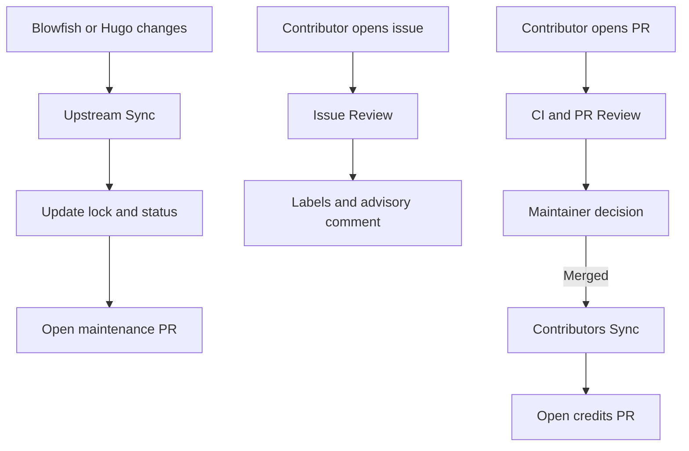

# Repository automation

[English](AUTOMATION.md) · [Tiếng Việt](AUTOMATION.vi.md)

The repository ships with safe-by-default GitHub Actions. Automation produces
advisory comments or reviewable pull requests and never merges changes.

## Automation flow



## Required repository settings

After pushing the repository:

1. Open **Settings → Actions → General**.
2. Allow GitHub Actions.
3. Set workflow permissions to **Read repository contents and packages**.
   Individual workflows request only the additional permissions they need.
4. Allow GitHub Actions to create pull requests. This is required by Upstream
   Sync and Contributors Sync.
5. Open **Settings → Models** and enable GitHub Models if the Issue Review and
   Pull Request Review workflows are not allowed to use `models: read`.
6. Enable **Issues**, **Discussions** if desired, and **Private vulnerability
   reporting**.
7. Create a branch ruleset for `main` requiring the `validate` status check and
   at least one maintainer approval.

The AI workflows use the repository `GITHUB_TOKEN`; no model API key is stored
in this template.

## Upstream Sync

File: `.github/workflows/upstream-sync.yml`

- Runs every Monday and on manual dispatch.
- Reads releases from `nunocoracao/blowfish` and `gohugoio/hugo`.
- Reads documentation revisions from the Blowfish docs tree and
  `gohugoio/hugoDocs`.
- Updates `upstream.lock.json` and `docs/UPSTREAM_STATUS.md`.
- Opens or refreshes `bot/upstream-sync`.

This bot intentionally does not overwrite the curated reference summaries.
Release notes can change behavior subtly, so its PR is the handoff for a
maintainer or contributor to update only affected references and run tests.

Run locally:

```bash
GITHUB_TOKEN=ghp_read_only_token npm run sync:upstream
```

The token is optional for public repositories but avoids the low anonymous API
rate limit.

## Issue Review

File: `.github/workflows/issue-review.yml`

- Runs when an issue is opened or edited.
- Applies a deterministic initial label.
- Treats the title and body as untrusted data.
- Sends a bounded prompt to GitHub Models.
- Creates or updates one bot comment with:
  - issue classification;
  - missing reproduction/version information;
  - likely affected files;
  - suggested maintainer next step.

The bot does not close issues, assign users, execute commands, or change source
files. If AI inference is unavailable, it posts a deterministic fallback
checklist.

## Pull Request Review

File: `.github/workflows/pr-review.yml`

- Uses `pull_request_target` so fork PRs can receive a review comment.
- Checks out only the trusted default branch.
- Fetches a bounded patch through the GitHub API.
- Never checks out or executes contributor code.
- Reviews Agent Skills structure, progressive disclosure, source quality,
  bilingual docs parity, script safety, workflow permissions, and tests.
- Creates or updates one advisory comment.

CI is separate and runs contributor code only with read-only permissions.

## Contributors Sync

File: `.github/workflows/contributors.yml`

- Runs after a pull request is merged or by manual dispatch.
- Fetches non-bot contributors through the GitHub API.
- Regenerates `CONTRIBUTORS.md`.
- Opens or refreshes `bot/update-contributors`.

Users who contribute only through issues, discussions, design, or translation
may be added manually with a short credit note.

## Releases

File: `.github/workflows/release.yml`

Pushing a tag such as `v1.0.0` validates the repository, packages only the
installable skill directory, and creates a GitHub Release with generated notes.

```bash
git tag v1.0.0
git push origin v1.0.0
```

## Optional Copilot automatic review

The repository includes `.github/copilot-instructions.md`. If you have an
eligible GitHub Copilot plan, you can configure a branch ruleset to
automatically request Copilot code review in addition to the included GitHub
Models review workflow.

## GitHub Sponsors button

`.github/FUNDING.yml` contains:

```yaml
github:
  - ginbarca
custom:
  - https://buymeacoffee.com/nva1308u
```

The Sponsor button appears after the `ginbarca` account is approved for GitHub
Sponsors and the repository is public. If the sponsor account differs from the
repository owner, update this file before the first release.

