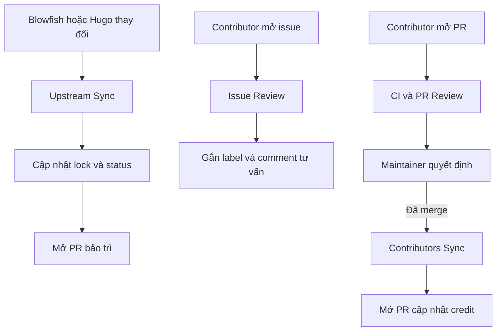

# Tự động hóa repository

[English](AUTOMATION.md) · [Tiếng Việt](AUTOMATION.vi.md)

Repository có sẵn các GitHub Actions ưu tiên an toàn. Automation chỉ tạo comment
tư vấn hoặc pull request để review, không tự merge thay đổi.

## Luồng automation



## Cấu hình repository cần thiết

Sau khi push repository:

1. Mở **Settings → Actions → General**.
2. Bật GitHub Actions.
3. Đặt quyền mặc định là **Read repository contents and packages**. Mỗi
   workflow chỉ xin thêm quyền tối thiểu cần thiết.
4. Cho phép GitHub Actions tạo pull request. Upstream Sync và Contributors Sync
   cần quyền này.
5. Mở **Settings → Models** và bật GitHub Models nếu Issue Review hoặc Pull
   Request Review chưa được phép dùng `models: read`.
6. Bật **Issues**, **Discussions** nếu cần và **Private vulnerability
   reporting**.
7. Tạo branch ruleset cho `main`, yêu cầu status check `validate` và ít nhất
   một maintainer approve.

Các workflow AI dùng `GITHUB_TOKEN` của repository; template không lưu model
API key.

## Upstream Sync

File: `.github/workflows/upstream-sync.yml`

- Chạy vào thứ Hai hàng tuần hoặc khi kích hoạt thủ công.
- Đọc release từ `nunocoracao/blowfish` và `gohugoio/hugo`.
- Theo dõi revision tài liệu trong Blowfish docs tree và
  `gohugoio/hugoDocs`.
- Cập nhật `upstream.lock.json` và `docs/UPSTREAM_STATUS.md`.
- Mở hoặc cập nhật branch `bot/upstream-sync`.

Bot không tự ghi đè các reference đã được biên soạn. Release note có thể làm
thay đổi hành vi tinh tế, vì vậy PR của bot là điểm bàn giao để maintainer hoặc
contributor chỉ cập nhật reference bị ảnh hưởng và chạy test.

Chạy local:

```bash
GITHUB_TOKEN=ghp_read_only_token npm run sync:upstream
```

Token không bắt buộc với repository public nhưng giúp tránh giới hạn API ẩn
danh thấp.

## Issue Review

File: `.github/workflows/issue-review.yml`

- Chạy khi issue được mở hoặc chỉnh sửa.
- Gắn label ban đầu bằng quy tắc xác định.
- Xem title và body là dữ liệu không tin cậy.
- Gửi prompt đã giới hạn kích thước tới GitHub Models.
- Tạo hoặc cập nhật một comment bot gồm:
  - phân loại issue;
  - thông tin version/reproduction còn thiếu;
  - file có thể bị ảnh hưởng;
  - bước tiếp theo đề xuất cho maintainer.

Bot không đóng issue, assign người, chạy lệnh hoặc sửa source. Nếu AI inference
không khả dụng, bot đăng checklist dự phòng xác định.

## Pull Request Review

File: `.github/workflows/pr-review.yml`

- Dùng `pull_request_target` để PR từ fork vẫn nhận được comment review.
- Chỉ checkout default branch đáng tin cậy.
- Lấy patch đã giới hạn qua GitHub API.
- Không checkout hoặc chạy code của contributor.
- Review cấu trúc Agent Skills, progressive disclosure, chất lượng nguồn, đồng
  bộ tài liệu song ngữ, an toàn script, quyền workflow và test.
- Tạo hoặc cập nhật một comment tư vấn.

CI là workflow riêng và chạy code contributor chỉ với quyền đọc.

## Contributors Sync

File: `.github/workflows/contributors.yml`

- Chạy sau khi PR được merge hoặc khi kích hoạt thủ công.
- Lấy contributor không phải bot qua GitHub API.
- Tạo lại `CONTRIBUTORS.md`.
- Mở hoặc cập nhật branch `bot/update-contributors`.

Người chỉ đóng góp bằng issue, discussion, thiết kế hoặc bản dịch có thể được
thêm thủ công cùng ghi chú credit ngắn.

## Release

File: `.github/workflows/release.yml`

Khi push tag như `v1.0.0`, workflow sẽ validate repository, đóng gói riêng thư
mục skill có thể cài và tạo GitHub Release kèm release note tự động.

```bash
git tag v1.0.0
git push origin v1.0.0
```

## Tùy chọn Copilot automatic review

Repository có `.github/copilot-instructions.md`. Nếu gói GitHub Copilot của bạn
hỗ trợ, hãy cấu hình branch ruleset để tự động yêu cầu Copilot code review song
song với workflow GitHub Models đi kèm.

## Nút GitHub Sponsors

`.github/FUNDING.yml` chứa:

```yaml
github:
  - ginbarca
custom:
  - https://buymeacoffee.com/nva1308u
```

Nút Sponsor xuất hiện sau khi tài khoản `ginbarca` được duyệt GitHub Sponsors
và repository ở chế độ public. Nếu tài khoản sponsor khác repository owner, hãy
sửa file này trước release đầu tiên.

